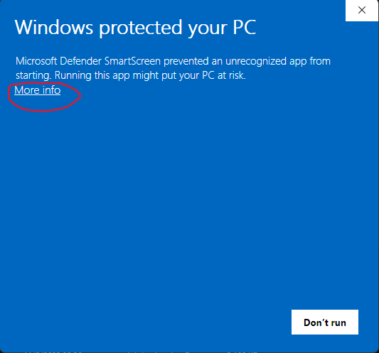
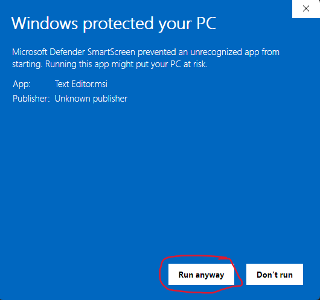
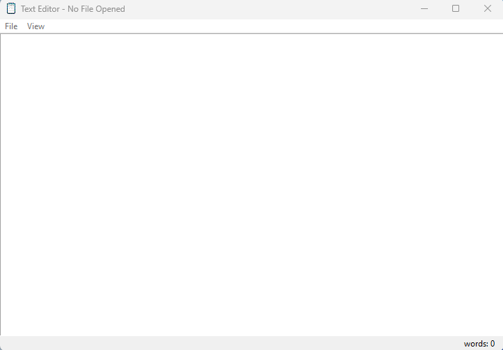

# Text Editor: A Python Text Editor for Education

Text Editor is a simple text editor built using Python's Tkinter library. It is designed with educational purposes in mind, making it an excellent tool for teaching beginners how to program or introducing them to the basics of graphical user interface (GUI) development. Text Editor is user-friendly, lightweight, and easily customizable, making it a valuable resource for both educators and learners.

**Website:** [Text Editor Website](https://user5012.github.io/Text_Editor/)

## Features

### 1. **Text Editing**
   - Create, open, save, and edit plain text files effortlessly.
   - Support for basic text editing functions like copy, cut

### 4. **Intuitive User Interface**
   - A clean and easy-to-navigate interface, ideal for beginners.
   - Menus, toolbar, and shortcuts for quick access to essential functions.
   
### 5. **Helpful Hints**
   - Integrated tooltips and hints provide useful information about different features.
   - Tips are designed to help users learn and understand the editor's capabilities.

## Getting Started

1. **Requirements**
   - Make sure you have Python 3 installed on your system.(if you don't you can download it from the official [Python Website](https://www.python.org/downloads/))
   
2. **Installation Script**
   - Clone this repository or download the ZIP file.
   - Run `python text_editor.py` from the terminal to launch Text Editor.

3. **Installation Setup**
   - Nevigate to `Buld 1.3` in github menu or go to my website[here](https://user5012.github.io/Text_Editor/download.html) and download it
   - Download either `Setup.exe` or `Text Editor.msi`
   - Run the `Setup.exe` or `Text Editor.msi`
   - If this window pops up click on `more info` and then `run anyway`

4. **Usage**
   - Create a new file or open an existing one.
   - Start editing your text or code.
   - Use the menus, toolbar, and shortcuts to perform various tasks.
   - Experiment with the customization options to make Text Editor your own.

## Screenshots

## License

This project is open-source, and the code is available under the MIT License.

## Acknowledgments

We would like to express our gratitude to the open-source community and the developers of the Tkinter library for making this project possible.

## Contact

If you have any questions, suggestions, or feedback, please don't hesitate to contact us:

- Email: kmamais100@gmail.com
- Twitter: [@TextEditorApp](https://twitter.com/TextEdiorApp)
- GitHub Issues: [Text Editor Issues](https://github.com/user5012/Text-Editor/issues)

Thank you for choosing Text Editor! Happy coding and learning!
